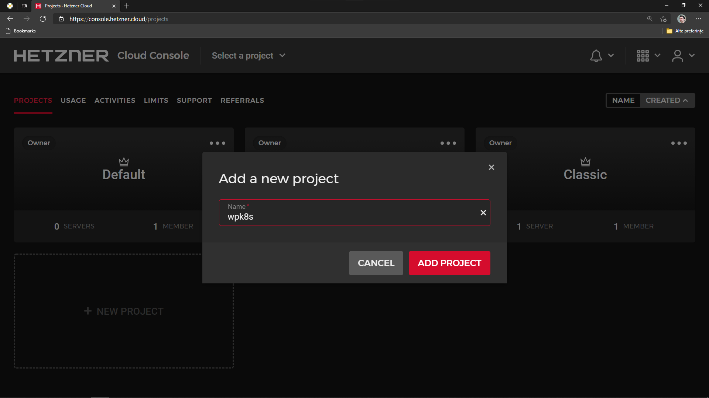
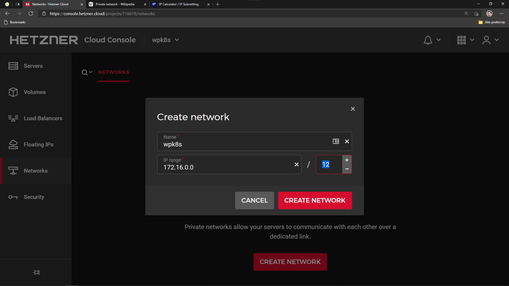
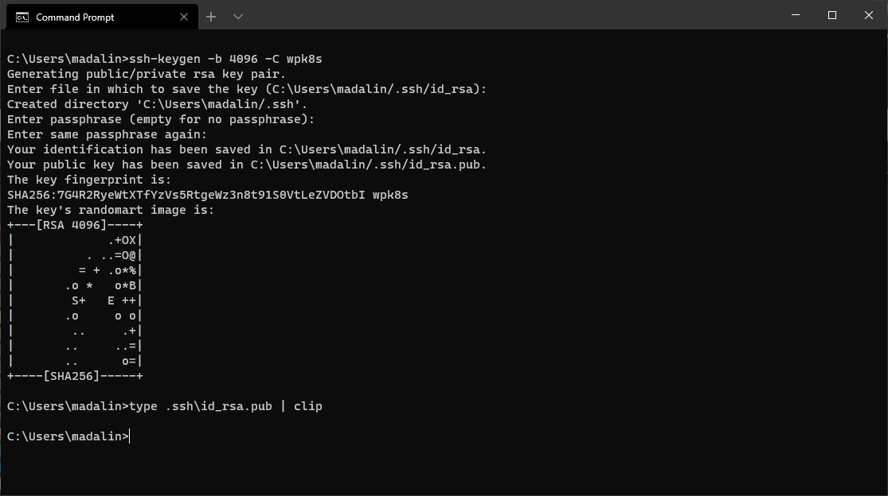
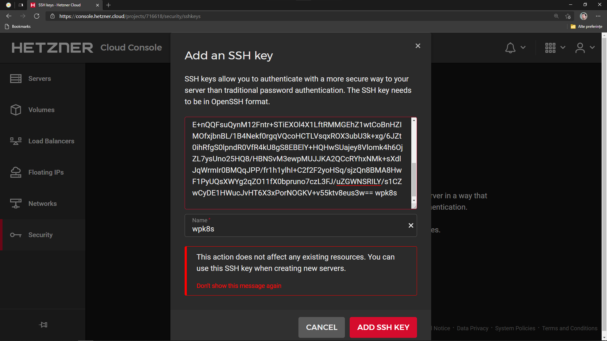

[[ch04-cloud-first-demo]]
== Cloud - first demo

In this chapter, we are going to try the same thing we did locally, but in the public cloud. We will cover single node, allowing us to run MicroK8s with only it's official supported addons, and we will use some configuration from begining that will allow us to upgrade to multiple nodes in the future.

To ensure an upgrade to multiple nodes will be possible, some things need to be considered and decided upon.

Most of the online resources will point towards using Kubernetes with multiple nodes on the same network, that are set in same VPC (Virtual Private Cloud) in Amazon AWS or any other provider, to ensure you can use an internal private network and easily share certain resources, like a networked file system, and focus on protecting the cluster with one internet single entry point.

Let's create a private network in our project.

For now let's focus on the simple implementation, just one node, MicroK8s with it's official addons, and make sure it can be extended.

I will be using https://www.hetzner.com[Hetzner] for my public cloud provider. Using them, will require going through the process to validate your identity, as they are very strict on security and avoiding fraud. You can use any preferred public cloud though, and adapt according to their dashboard, as things are fairly common between clouds. I personally choose Hetzner, as they have great performance and security, while being low in price, and they suit my personal project requirements saving me a lot of money. I am not concerned about locations of servers, as on top I use Cloudflare which will ensure delivery with lowest latency responses to the visitors - more in a later chapter about this.

If you want to read some comparison done by https://toys.lerdorf.com/low-cost-vps-testing[Rasmus Lerdorf] on reasonably priced public cloud servers, it may help you in reaching a decision. I think he is a better reference than I to influence your choice.

Let's start with one basic cloud server, sized at 1 or 2 cores and 2GB of RAM to experiment.

Hetzner supports the separation of resources by naming them 'Projects'. Either use the default one or, preferably, create a new dedicated one to learn. Resources in one project are isolated from other projects. Projects also allow you to invite collaborators, and they will be limited at the project level. A project can also be transferred later to a client (with some limits).

Click on *+ NEW PROJECT*, give it a name, example `wpk8s` and click *ADD PROJECT*.

Next, on the left sidebar, click *Networks*, click *CREATE NETWORK*, name it, for example `wpk8s`, and give it a range, like `172.16.0.0`. This will be a full class B private network, Hetzner creates sub networks inside of it, and that will give us 65534 auto assignable ip addresses that on any cloud server with this network attached will be pre configured if selected on creation. Alternatively, they are configurable manually in a very simple way linked from the dashboard. As a note, the reason I use class B networks is becasue they are used less in local networks, avoiding issues with some vpn configurations.

If you have not used ssh, you need to generate one.

On Windows 10, if you have it recently installed, you should have ssh preinstalled (openssh). If not, open *Settings* > *Applications*, click *Optional features* link. If you see *OpenSSH client* you have it, if not, click on *Add feature*, search `openssh` and install the *client*; server is available also, so make sure you do not select that one! Now open *CMD* or *Windows Terminal* and type `ssh-keygen -b 4096 -C 'some-word-to-identify-this-computer'` replacing the _some-word-to-identify-this-computer_ with something representative for you. After a few *Enter* presses, when back on prompt, run `type .ssh\id_rsa.pub | clip`. This will copy the public version of the key in the clipboard, and you can paste it now in Hetzner's ssh panel.

On MacOS, open *Terminal* and run `ssh-keygen -b 4096 -C 'some-word-to-identify-this-computer'` replacing the _some-word-to-identify-this-computer_ with something representative for you. After a few *Enter* presses, when back on prompt, run `cat .ssh/id_rsa.pub | pbcopy`.

In Linux, like on MacOS, to copy in the clipboard run `cat .ssh/id_rsa.pub` and select and copy with the mouse. An alternative to _clip_ and _pbcopy_ does not come by default with most distributions and there are a lot of them, all different between X11 and Wayland.

In the Hetzner panel, in the sidebar, click *Security*, *ADD SSH KEY*, paste the key, it's name will be prefilled with the comment name you used when generated, but you may change it to identify it easy here in the panel.

*Create a new server.* Click on *Servers*, *ADD SERVER*

*Select a location*. For the future, using multiple locations is ideal for High Availability, something I will detail in different scenarios in the following chapters - worry free, no alarms at 3AM. I use servers in the same location to do horizontal scaling and multiple locations to setup
replications for high availability or disaster recovery, depends on what the clients choose.

*Select Ubuntu 20.04 or latest LTS version*. Setup can be done on other distributions, but for simplicity, I will demo using Ubuntu. Also MicroK8s is distributed through Snap, which is best integrated on Ubuntu.

*Select CX11 or CXP11*.

*Select the network we created*. This will automatically setup the private network in the cloud server and doing this, even for a single node, will help you for future expansion.

The next step is optional, but I strongly recommend you do it. Many cloud providers give you default access on root user. I recommend using a normal user with admin excalation capability and increase the security of the ssh server. Click on user data and type or copy/paste the following, changing the user if you wish to:

.https://gist.github.com/madalinignisca/93339ec774b00bc5589b3a45fc968eb5#file-cloud-init-sh[cloud-init.sh]
[source,shell,linenums]
----
#!/bin/bash
set -euo pipefail

USERNAME=wpk8s # TODO: Customize the sudo non-root username here

# Create user and immediately expire password to force a change on login
useradd --create-home --shell "/bin/bash" --groups sudo "${USERNAME}"
passwd --delete "${USERNAME}"
chage --lastday 0 "${USERNAME}"

# Create SSH directory for sudo user and move keys over
home_directory="$(eval echo ~${USERNAME})"
mkdir --parents "${home_directory}/.ssh"
cp /root/.ssh/authorized_keys "${home_directory}/.ssh"
chmod 0700 "${home_directory}/.ssh"
chmod 0600 "${home_directory}/.ssh/authorized_keys"
chown --recursive "${USERNAME}":"${USERNAME}" "${home_directory}/.ssh"

# Disable root SSH login with password
sed --in-place 's/^PermitRootLogin.*/PermitRootLogin prohibit-password/g' /etc/ssh/sshd_config
if sshd -t -q; then systemctl restart sshd fi
----

_original source: https://docs.digitalocean.com/tutorials/recommended-droplet-setup/[Digital Ocean]_

Select the SSH key you added.

Give it a *fully qualified domain name* as name. I'll be using `vm1.hel1.wp.k8s`. Make sure you use a proper *https://en.wikipedia.org/wiki/Fully_qualified_domain_name[fqdn]*, as this is required for MicroK8s on multi-nodes setup, at the moment of writing this book. The domain name does not need to be a real registered one. I use domains with a DNS that does not exist, to avoid dns issues in the case of somebody else registering it.

Hit the Create button and wait a few seconds, usually 15-30 seconds, and you can copy the server's ip, just clicking on it is necessary and back in your terminal ssh into it, for example: `ssh wpk8s@135.181.93.201`. It will ask the first time for a password. Type a decent strong password, hit enter, you will need to confirm it, and the it will exit. Now hit up key again and ssh back into it. It should login without asking for the password.

From now on, the password will be required only when we run commands using `sudo` or if you need to ssh in from another device.

Next we can repeat the same scenario we had in the local experiment from the previous chapter, except that we need to install *snap* to be able to install MicroK8s. Snap might come preinstalled on some other public cloud providers. The following first commands should be run anyway in an online environment.

Repeat the process to add a ssh config to Visual Studio Code and you'll be able to write files and get instant terminal access in the virtual machine. Once connected and opening a terminal in it, continue with the following.

Run updates:

`sudo apt update`

(This will refresh system's package database).

If there are updates, you can list as suggested by running:

`sudo apt list --upgradable`

and IF within the list there are packages part of *focal-security*, I
strongly recommend you run

`sudo apt upgrade -y`

Within the list, if there is also the linux kernel (starts with linux-image), please do a reboot of the virtual server after it finishes and wait around 30 seconds before you ssh back in.

Now install *snap* (make sure you type *snapd* for package installation, as snap package older and kept this namespace):

`sudo apt install -y snapd`

Next add MicroK8s:

`sudo snap install --classic microk8s`

It will download and install the latest version of it, and we can repeat our previous WordPress deployment.

To recap the identical scenario that we have experimented locally:

Enable DNS, Ingress and Storage addons.

`sudo microk8s enable dns ingress storage`

Create a folder named `wordpress` and within it create the same files we did previously.

.https://gist.github.com/madalinignisca/93339ec774b00bc5589b3a45fc968eb5#file-kustomization-yaml[kustomization.yaml]
[source,yaml,linenums]
----
---
secretGenerator:
- name: mysql-root-pass
  literals:
  - password=password123
- name: mysql-user
  literals:
  - user=wordpress
- name: mysql-pass
  literals:
  - password=wordpress
- name: mysql-database
  literals:
  - database=wordpress
resources:
  - mysql.yaml
  - wordpress.yaml
----

.https://gist.github.com/madalinignisca/93339ec774b00bc5589b3a45fc968eb5#file-mysql-yaml[mysql.yaml]
[source,yaml,linenums]
----
---
apiVersion: v1
kind: Service
metadata:
  name: wordpress-mysql
  labels:
    app: wordpress
spec:
  ports:
    - port: 3306
  selector:
    app: wordpress
    tier: mysql
  clusterIP: None
---
apiVersion: apps/v1
kind: StatefulSet
metadata:
  name: wordpress-mysql
  labels:
    app: wordpress
spec:
  selector:
    matchLabels:
      app: wordpress
      tier: mysql
  serviceName: wordpress-mysql
  template:
    metadata:
      labels:
        app: wordpress
        tier: mysql
    spec:
      containers:
      - image: mariadb:10.6
        name: mysql
        env:
        - name: MARIADB_ROOT_PASSWORD
          valueFrom:
            secretKeyRef:
              name: mysql-root-pass
              key: password
        - name: MARIADB_DATABASE
          valueFrom:
            secretKeyRef:
              name: mysql-database
              key: database
        - name: MARIADB_USER
          valueFrom:
            secretKeyRef:
              name: mysql-user
              key: user
        - name: MARIADB_PASSWORD
          valueFrom:
            secretKeyRef:
              name: mysql-pass
              key: password
        - name: MARIADB_AUTO_UPGRADE
          value: "true"
        ports:
        - containerPort: 3306
          name: mysql
        volumeMounts:
        - name: wordpress-mysql
          mountPath: /var/lib/mysql
  volumeClaimTemplates:
  - metadata:
      name: wordpress-mysql
    spec:
      accessModes: [ "ReadWriteOnce" ]
      resources:
        requests:
          storage: 1Gi
----

.https://gist.github.com/madalinignisca/93339ec774b00bc5589b3a45fc968eb5#file-wordpress-volume-yaml[wordpress-volume.yaml]
[source,yaml,linenums]
----
---
apiVersion: v1
kind: PersistentVolumeClaim
metadata:
  name: wordpress
spec:
  accessModes:
    - ReadWriteOnce
  resources:
    requests:
      storage: 2Gi
----

.https://gist.github.com/madalinignisca/93339ec774b00bc5589b3a45fc968eb5#file-wordpress-yaml[wordpress.yaml]
[source,yaml,linenums]
----
---
apiVersion: networking.k8s.io/v1
kind: Ingress
metadata:
  name: wordpress
  labels:
    app: wordpress
spec:
  rules:
  - host: wordpress.k8s
    http:
      paths:
        - pathType: Prefix
          path: "/"
          backend:
            service:
              name: wordpress
              port:
                number: 80
---
apiVersion: v1
kind: Service
metadata:
  name: wordpress
  labels:
    app: wordpress
spec:
  ports:
  - port: 80
    protocol: TCP
  selector:
    app: wordpress
    tier: frontend
---
apiVersion: apps/v1
kind: Deployment
metadata:
  name: wordpress
  labels:
    app: wordpress
spec:
  selector:
    matchLabels:
      app: wordpress
      tier: frontend
  template:
    metadata:
      labels:
        app: wordpress
        tier: frontend
    spec:
      initContainers:
      - name: init-mysql
        image: busybox
        command: ['sh', '-c', 'until nslookup wordpress-mysql; do echo waiting for mysql; sleep 2; done;']
      containers:
      - image: wordpress
        name: wordpress
        env:
        - name: WORDPRESS_DB_HOST
          value: wordpress-mysql
        - name: WORDPRESS_DB_USER
          valueFrom:
            secretKeyRef:
              name: mysql-user
              key: user
        - name: WORDPRESS_DB_NAME
          valueFrom:
            secretKeyRef:
              name: mysql-database
              key: database
        - name: WORDPRESS_DB_PASSWORD
          valueFrom:
            secretKeyRef:
              name: mysql-pass
              key: password
        ports:
        - containerPort: 80
          name: wordpress
        volumeMounts:
        - name: wordpress
          mountPath: /var/www/html
      volumes:
        - name: wordpress
----

Open the terminal and change directory `cd wordpress`.

Run

`sudo microk8s kubectl apply -f ./wordpress-volume.yaml`

`sudo microk8s kubectl apply -k ./`

and while we wait 1-2 minutes for the first time deployment, let's put the ip of the cloud server in our local hosts file to test our online WordPress installation.

On Windows, right click on the *Start* icon and click on *Command Prompt (admin)* or *Powershell (admin)*, whichever is available. After confirming privileges elevation run `notepad drivers\etc\hosts` and add `172.16.0.1 wordpress.k8s` at the bottom of the file - *make sure to use the ip from the cloud server you have created instead of 172.16.0.1*.

On MacOS or Linux, open the terminal and run `sudo nano /etc/hosts` and add `172.16.0.1 wordpress.k8s` at the bottom of the file - *make sure to use the ip from the cloud server you have created instead of 172.16.0.1*. `Ctrl+x`, `y`, `Enter` will save and exit.

After you saved the hosts file, try loading https://wordpress.k8s in the browser.

NOTE: I did not set anything up for *HTTPS* yet as we are going to look at different ways we can set that up, as you might need to know each one, depending on how your clients need to have *HTTPS* configured.

WARNING: Do not leave this demo WordPress available online as it is. Run it's deletion command again `sudo microk8s kubectl delete -k ./` and you could even delete the cloud server (you will need to recreate it for future chapters). To delete the mysql and wordpress volumes run `sudo microk8s kubectl delete -f ./wordpress-volume.yaml` and `sudo microk8s kubectl delete pcv data-wordpress-mysql-0`.

OK, so we did it, we had live online WordPress, running on MicroK8s. What is next?

In the following chapter we will concentrate on how to prepare _recipes_ to ensure the services use the exact versions we need and we will experiment in upgrading them, as this is a critical requirement in a secured environment and also a necessity for avoiding bugs.

We will also extend our *WordPress* websites with extra services like ElasticSearch to have blazing speed in searches, and instant suggestions, and add caching using Redis, add monitoring and observability, alerts and many other things. If I have really captured your attention, I do hope you will enjoy the full book.
