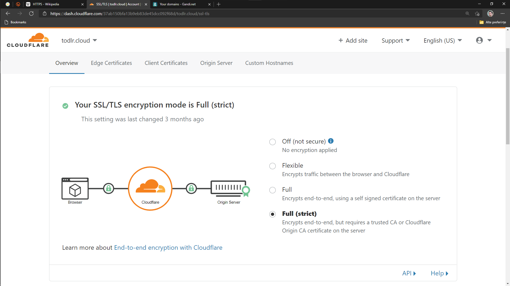
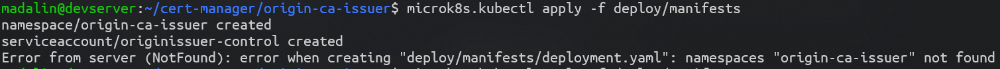

[[ch05-https]]
== HTTPS

HTTPS is mandatory today for a website. It can work without, but to have a website, an online service, serving visitors from everywhere, HTTPS is essential to offer them a guarantee that data traveled between their device and your website is encrypted and no middleman will be able to capture the sensitive personal data they might share with you.

I'll give you a basic example related to common WordPress usage. Lets say you host a popular local news website that allows visitors to comment on the published articles. Your comment form asks for a name and an email, besides the comment body. The website is served without a secure certificate. In the region, there's public WiFi access in all main areas, and most of the local people have been connecting to this network without too much worry. Your website and the public WiFi is trusted by the local community. But recently, although nobody knew, due to poor security of the public WiFi network, a hacker managed to infiltrate some service, capturing all insecure data traffic, between clients and the target service. In this case, your website. So, the hacker can easily collect all names, emails, and all associated to sell them to some organization with evil intentions. Worse still, he can even rewrite parts of the responses, and change the truth of some articles.

OK, the previous paragraph might sound a bit harsh, but it is an entirely possible scenario. It would be even worse where critical personal information is concerned. We use WordPress to create websites for medical centers, for kindergartens, news services, etc. It is absolutely necessary to make our website or service use http://j.mp/3b8zE9D[HTTPS].

To demonstrate this, I will prepare the following scenarios using subdomains of real domains that I own, as this is the most common scenario I believe the readers of this book would intend on using. To be able to fully understand this, you should practice it with at least one real domain. If you don't have any, you could buy a domain to use for a personal portfolio, blog or email etc.

Before we dive into setting up secure servers, one thing to note is this layer of the service involves additional cpu usage, not too much if the traffic is low on a website, but on a heavy traffic WooCommerce website, during a Black Friday event, it would be easier to measure what effect it is having. So, we will cover solutions starting with the most simple and then move to advanced.

Let's create a very light **healtcheck** service, that you could use in your clusters in order to provide some endpoints for doing a basic healthcheck for an Ingress entry.

Create a directory of your choice, for example `healthcheck`, and add:

.healthcheck-service.yml
[source,yaml,linenums]
----
apiVersion: apps/v1
kind: Deployment
metadata:
  labels:
    app: healthcheck
  name: healthcheck
spec:
  replicas: 1
  selector:
    matchLabels:
      app: healthcheck
  template:
    metadata:
      labels:
        app: healthcheck
    spec:
      containers:
      - image: gcr.io/google-samples/hello-app:1.0
        name: hello-app
---
apiVersion: v1
kind: Service
metadata:
  labels:
    app: healthcheck
  name: healthcheck
spec:
  ports:
  - port: 8080
    protocol: TCP
    targetPort: 8080
  selector:
    app: healthcheck
  type: NodePort
----

=== cert-manager

With almost every method of setting up https and using digital x509 certificates, we need a way to handle them. Meet https://cert-manager.io[**cert-manager**].

What it does, exactly as it's name suggests, is manage certificates in a kubernetes cluster. Shortly in this book, I will focus on how it handles Let's encrypt and Cloudflare edge.

To install cert-manager, all we need to do is run one command. First, please open https://github.com/jetstack/cert-manager/tags[cert-manager tags] on Github, and check for the most high release tag version possible. At the time of writting this book, it's 1.2.0. Now, run, replacing the version if necessary: `microk8s.kubectl apply -f https://github.com/jetstack/cert-manager/releases/download/v1.2.0/cert-manager.yaml`

In about a minute or two, it should finish applying minimal configuration and start the required services it needs. We have not yet spent time on RBAC, but if you have enabled it in the cluster, do be aware it needs extra setup that we will cover later in the book, however it is not needed at this current level.

Next, we will cover three cases: ACME / Let's encrypt, CA issuer (possibly useful for remote testing clusters) and external Cloudflare Origin CA.

=== Let's encrypt

Let's encrypt needs to verify and validate the ownership of the domain or subdomain that the certificate is intended to be used with. Without this, a certificate can't be issued. The easy way is HTTP01 and the more complicated one is DNS01, but the latter is needed for wildcard certificates.

Let's start with the HTTP01, easiest to setup and most widely used.

We need to setup a cert-manager Issuer that will automatically handle creation and renewals of certificates. Let's encrypt has a staging and a production mode, and I would recommend setting up both, in case you need to test before production, staging is very relaxed over api calls. Forcibly going to production while something is not configured right, might cause it to reach it's failed validation limit of 5 per hour on a host. Trying staging first will ive you assurance that production will not fail. Read more https://letsencrypt.org/docs/rate-limits/[here] if necessary.

Next, let's create the Staging Issuer. Make a folder named `cert-manager`. Create an `acme-staging-issuer.yml` file and paste the following, making sure you replace the **email** key value with a real one you have access to. It's important as any issues related to the certificate will be sent to this email address.

.acme-staging-issuer.yml
[source,yaml,linenums]
----
---
apiVersion: cert-manager.io/v1
kind: ClusterIssuer
metadata:
  name: letsencrypt-staging
spec:
  acme:
    email: user@example.com
    server: https://acme-staging-v02.api.letsencrypt.org/directory
    privateKeySecretRef:
      name: letsencrypt-staging
    solvers:
    - http01:
       ingress:
         class: public
----

And the production Issuer, replacing the **email** key value, in `acme-production-issuer.yml`

[source,yaml,linenums]
----
apiVersion: cert-manager.io/v1
kind: ClusterIssuer
metadata:
  name: letsencrypt-prod
spec:
  acme:
    email: user@example.com
    server: https://acme-v02.api.letsencrypt.org/directory
    privateKeySecretRef:
      name: letsencrypt-prod
    solvers:
    - http01:
       ingress:
         class: public
----

Let's apply the configuration (change directory to where you created the folder with the files).

[source,shell]
----
cd ~/cert-manager
microk8s.kubectl apply -f ./acme-staging-issuer.yml
microk8s.kubectl apply -f ./acme-production-issuer.yml
----

Each apply command should output:
[source,shell]
----
issuer.cert-manager.io "letsencrypt-staging" created
issuer.cert-manager.io "letsencrypt-prod" created
----

You can check their validity running:
[source,shell]
----
microk8s.kubectl describe issuer letsencrypt-staging
microk8s.kubectl describe issuer letsencrypt-prod
----

Next, let's create a demo configuration to create and test our Let's encrypt configuration:

.demo-letsencrypt-ingress.yml
[source,yaml,linenums]
----
---
apiVersion: networking.k8s.io/v1
kind: Ingress
metadata:
  name: wpk8s-club-demo
  annotations:
    cert-manager.io/issuer: "letsencrypt-staging"
spec:
  tls:
  - hosts:
    - demo.wpk8s.club
    secretName: wpk8s-club-demo-tls
  rules:
  - host: demo.wpk8s.club
    http:
      paths:
        - pathType: Prefix
          path: "/"
          backend:
            service:
              name: healthcheck
              port:
                number: 8080
----

Let's apply:
`microk8s.kubectl apply -f demo-letsencrypt-ingress.yml`

We can monitor generation of the certificate by running: `microk8s.kubectl get certificate`. This will list all current certificates. The status is in the `Ready` column and once ok, should be `True`.

To inspect the certificate run: `microk8s.kubectl describe certificate wpk8s-club-demo-tls`, replacing "wpk8s-club-demo-tls" with the name you gave for the certificate.

If it worked, let's make it ready for production.

Edit the `demo-letsencrypt-ingress.yml` and change `letsencrypt-staging` to `letsencrypt-prod`.

.demo-letsencrypt-ingress.yml
[source,yaml,linenums]
----
---
apiVersion: networking.k8s.io/v1
kind: Ingress
metadata:
  name: wpk8s-club-demo
  annotations:
    cert-manager.io/issuer: "letsencrypt-prod"
spec:
  tls:
  - hosts:
    - demo.wpk8s.club
    secretName: wpk8s-club-demo-tls
  rules:
  - host: demo.wpk8s.club
    http:
      paths:
        - pathType: Prefix
          path: "/"
          backend:
            service:
              name: healthcheck
              port:
                number: 8080
----

Let's apply: `microk8s.kubectl apply -f demo-letsencrypt-ingress.yml`

Check it's status: `microk8s.kubectl get certificate` and once done, Try to load the website in your browser.

Wait! We missed something. Try to load the website by adding www in front. Won't work. Why? Simple: we must be explicit about host aliases.

Let's add the extras to `wordpress--statefulset.yml` and apply again.

.demo-letsencrypt-ingress.yml
[source,yaml,linenums]
----
---
apiVersion: networking.k8s.io/v1
kind: Ingress
metadata:
  name: wpk8s-club-demo
  annotations:
    cert-manager.io/issuer: "letsencrypt-prod"
    nginx.ingress.kubernetes.io/server-alias: "www.demo.wpk8s.club"
spec:
  tls:
  - hosts:
    - demo.wpk8s.club
    - www.demo.wpk8s.club
    secretName: wpk8s-club-demo-tls
  rules:
  - host: demo.wpk8s.club
    http:
      paths:
        - pathType: Prefix
          path: "/"
          backend:
            service:
              name: healthcheck
              port:
                number: 8080
----

I added `nginx.ingress.kubernetes.io/server-alias: "www.demo.wpk8s.club"` annotation so nginx will know that the `www.wpk8s.club` is an alias vhost for my website and I added the entry also to the tls spec, letting cert-manager know it needs to add it to the SAN entry of the certificate.

Understanding certificates needs a long good chapter, and today's standards are slightly different from what they were many years ago and some classic usage of paid certificates might not be compliant with what modern browsers like Microsoft Edge, Google Chrome and Firefox prefer.

What we have managed above, is the basics of modern free certificates with Let's encrypt, and we will come back to the topic when you want to cover extra SAN (Subject Alternate Name), when we see how to manage a common certificate for WordPress Multi-Sites installation.

NOTE: Wildcard Let's Encrypt certificates must be done differently, and require a more complex setup. I will detail this in a dedicated chapter later, to keep things simple at first.

=== Cloudflare

This setup involves Cloudflare to provide public facing certificate for visitors and private certificate for communication between Cloudflare network and our infrastructure. Alternatives to Cloudflare should provide an identical result.

IMPORTANT: If you are going to use services like Cloudflare, I strongly recommend that you read up on any component used from it tand research it's pricing model carefully. Cloudflare starts from free, and can cover all the essential needs of a WordPress website, including DNS, DDOS protection, Cache and Firewall on the free level offered, but each of them, and all the extras come with small prices which can increase depending on different aspects.

What we see in the screenshot above is the browser communicating securely with Cloudflare, which communicates securely with our server. You should research for a deep dive into the topic using http://j.mp/37jBl2P[their official support pages], though at the moment you only want to understand the technical aspects of how it works. I will guide you step by step on how to implement this.

First, if you do not have a Cloudflare account, proceed to create one. The registration does not involve any spending and it's a process of only a few minutes. If you do not want to do it yet, it's fine, read along or feel free to jump to the alternative fully managing on your own digital certificates, I will provide minimal security tips throughout the book which should be enough to help.

Cloudflare requires that the domain name will use them as DNS, so you will have to go through their process of switching the DNS nameservers for your domain to them. The process is easy, and will copy all current DNS records to make sure it will not break any already setup email records, anti spam records and others you might already have. Make sure to review all discovered records, and once you do transfer the nameservers, there might be a few minutes to a few hours of a waiting period to be fulfilled. Cloudflare will offer you a status change if you go back to check the page anytime you want.

IMPORTANT: Keep Origin CA certificates configuration separate from a website's kubernetes configuration; it will detail the structuring configuration in files and directories verbosely. To fully benefit from Cloudflare's total protection, the **SSL/TLS encryption mode** must be set to **Full (strict)**. Remember, that this affects all possible subdomains proxied through Cloudflare!

First, we need to install support for Origin CA of Cloudflare.

Create a new directory named for example `cloudflare`.

In it use git to clone https://github.com/cloudflare/origin-ca-issuer.git[Origin CA issuer] repo or on https://github.com/cloudflare/origin-ca-issuer/releases[Releases] page download the latest zip, and unzip it in the `cloudflare` directory.

Change directory into it and run the following commands:

[source,shell]
----
microk8s.kubectl apply -f deploy/crds
kubectl apply -f deploy/manifests
----

You might spot an error in output like this, but due to Kubernetes nature of self healing, the manifests will be applied.

IMPORTANT: For the next part,  it is a bit tricky, so make sure you are careful to use your exact CA API key as the example one is only a fake one to provide the example.

Change directory one level up, should now be in `cloudflare`.

[source,bash]
----
microk8s.kubectl create secret generic --dry-run=client -n default \
    origin-ca-service-key \
    --from-literal key=v1.0-XXXXXXXXXXXXXXXXXXXXXXXXXXXXXXXXXXXXXXXXXXXXXXX \
    -oyaml > origin-ca-issuer-service-key.yml
----

Create a new file `origin-issuer.yml` and paste the following:

[source,yaml,numlines]
----
---
apiVersion: cert-manager.k8s.cloudflare.com/v1
kind: OriginIssuer
metadata:
  name: origin-prod-issuer
  namespace: default
spec:
  requestType: OriginECC
  auth:
    serviceKeyRef:
      name: origin-ca-service-key
      key: key
----

Let's apply the configuration:

[source,bash]
----
microk8s.kubectl apply -f origin-ca-issuer-service-key.yml
microk8s.kubectl apply -f origin-issuer.yml
----

What did we just do? We have created our Cloudflare Origin CA issuer which will be used to ask Cloudflare to prepare, if it doesn't exist, an origin certificate, and schedule it's refresh as needed.

We can create common origin certificates for handling all subdomains of one domain and reuse in Ingress configurations or, on Ingress configuration we can do isolated definitions to be explicit on using a dedicated origin certificate for a specific subdomain.

The second version is preferred for best security, as Cloudflare does not limit how many origin certificates are handled.

Cloudflare offers an additional security enhancement: **Authenticated Origin Pulls**. The following is the explanation from their documentation:

*Authenticated Origin Pulls allow you to cryptographically verify that requests to your origin server have come from Cloudflare using a TLS client certificate. This prevents clients from sending requests directly to your origin, bypassing security measures provided by Cloudflare, such as IP and Web Application Firewalls, logging, and encryption.*

If you enable it, the website will continue to work, but in order to actually use it, we need to setup an additional certificate resource in our cluster, that will be used on any website where we want to use it.

To utilise this, we first need to setup a secret in our Cluster, to keep the `origin-pull-ca.pem` certificate we can download from Cloudflare, and use it with https://kubernetes.github.io/ingress-nginx/user-guide/nginx-configuration/annotations/#client-certificate-authentication[Nginx Ingress annotations]

To download it, copy the link from the above article, to make sure you are using the latest published version. I had some confusion initially as the certificate validity date was in the past, so I thought it had expired and wondered why they used it. Technically that is not a blocker, a certificate for private end to end encryption is not locked by expiration, there is a choice whether to accept or reject.

In a directory you want to keep certain files, like this one, download it:

`curl -LO https://support.cloudflare.com/hc/en-us/article_attachments/360044928032/origin-pull-ca.pem`

The above command would download the version that was published at the date I was writing this chapter, so be sure to replace it with the current version if it has been updated.

IMPORTANT: Always, always, always check the certificate: `openssl x509 -in origin-pull-ca.pem --noout -text`. And read allthe entire output to ensure it really is the certificate you intend to use. Signatures and other data from the output can actually help you to make sure you have the real certificate you intend to use, comparing to trusted data the issuer could provide you. Also, ALWAYS use this command to make sure you have a real valid certificate before you create or update it in Kubernetes.

Create a `cloudflare-origin-pull-ca-secret.yml.tmpl` file and paste the following:

.cloudflare-origin-pull-ca-secret.yml.tmpl
[source,yaml,numlines]
----
apiVersion: v1
kind: Secret
metadata:
  name: cloudflare-origin-pull-ca-tls
type: generic
data:
  ca.crt: ORIGIN_PULL_CA_PEM
----

IMPORTANT: DO NOT try to change `ca.crt` key value name as it is expected by Nginx Ingress annotation and there is currently no way to override it.

Now, create a shell script so you do not need to learn a longer complicated command to apply it when you will need to update it.

.cloudflare-origin-pull-ca-secret-apply.sh
[source,shell,numlines]
----
#!/usr/bin/env sh
sed "s/ORIGIN_PULL_CA_PEM/`cat origin-pull-ca.pem|base64 -w0`/g" \
  cloudflare-origin-pull-ca-secret.yml.tmpl | microk8s.kubectl apply -f -
----

If you have already read about TLS certificates and Kubernetes, you might have noticed that I used `generic` type to store it. That is because `kubernetes.io/tls` is for client or server certificates, which **cert-manager** manages for example. We will cover that type in the next section, where we see how to manage certificates you might have paid for if you need to use an EV TLS certificate for example.

Let's check if the certificate has been stored correctly.

`microk8s.kubectl get secret cloudflare-origin-pull-ca-tls -o json | jq -r '.data["origin-pull-ca.pem"]' | base64 --decode`

And output the certificate:

`cat origin-pull-ca.pem`

They should be identical.

You could even script this:

.diff-certificates.sh
[source,bash,numlines]
----
#!/usr/bin/env bash
diff \
  <(cat origin-pull-ca.pem) \
  <(microk8s.kubectl get secret cloudflare-origin-pull-ca-tls \
    -o json | \
    jq -r '.data["origin-pull-ca.pem"]' | base64 --decode)
----

Save `diff-certificates.sh` and run

`bash ./diff-certificates.sh`

If any differences exist, they will be outputed. If there is no difference, then there will be no output. Nothing means good to go!

OK, let's now apply our certificate to our testing Ingress entry.

Let's change directory to where we stored the `test.yaml` for our origin subdomain experiment.

.test.yml
[source,yaml,numlines]
----
---
apiVersion: networking.k8s.io/v1
kind: Ingress
metadata:
  name: wpk8s-club-origin-ingress
  annotations:
    nginx.ingress.kubernetes.io/rewrite-target: /$1
    nginx.ingress.kubernetes.io/auth-tls-secret: "default/cloudflare-origin-pull-ca-tls"
    nginx.ingress.kubernetes.io/auth-tls-verify-client: "on"
    nginx.ingress.kubernetes.io/auth-tls-verify-depth: "1"
spec:
  tls:
  - hosts:
    - origin.wpk8s.club
    secretName: wpk8s-club-origin-tls
  rules:
    - host: origin.wpk8s.club
      http:
        paths:
          - path: /
            pathType: Prefix
            backend:
              service:
                name: healthcheck
                port:
                  number: 8080
----

Add the extra annotations from the above to your file. Make sure your host values are pointing to your subdomain, as covered when we created it initially.

To check it, load the url in the browser and it should still work. Now to check rejection.

In the command line run:

`curl -vk --resolve "origin.wpk8s.club:443:192.168.1.130" https://origin.wpk8s.club`

replacing with your domain / subdomain and the IP of the server. You should see something like this:

[source,html,numlines]
----
<html>
<head><title>400 No required SSL certificate was sent</title></head>
<body>

<h1>400 Bad Request</h1>

No required SSL certificate was sent

nginx/1.19.2

</body>
</html>
----

If so, everything works as expected.

What have we achieved?

We use Cloudflare to handle HTTPS for us and protect the origin server, while also affording us the benefit of extra cache closer to our visitors. Cloudflare will make sure our origin is the expected one, by verifying the origin's certificate against the one it generated for us from cert-manager's automation. Our origin server is strict, allowing only Cloudflare to make requests to this particular domain.

I strongly recommend this type of configuration for websites that, to give a few examples, are made to handle authenticated users, transport real personal data or deal with any elements of membership, also ecommerce or bookings and events for visitors. The risk of an exposure of sensitive data would be minimized, which allows us to focus only on keeping our WordPress core, plugins and theme up to date, and of course, keeping apache, php and mariadb services at recent maintained versions covered by all security updates.

=== Bought SSL/TLS certificates

In this last part, I will go through one of possibly the most simple configurations to use, for the ones that might require a particular type of certificate, especially the EV type, which would be the type of certificate a company would use, to prove their validation is from a trusted authority. I actively recommend this type of certificates to all companies I maintain infrastructure for.

Read more on https://en.wikipedia.org/wiki/Extended_Validation_Certificate[Wikipedia] about this particular type of certificates that are more trustworthy in certain cases.

Next, to continue with the example on how we saved an origin CA certificate I will present how to store an SSL/TLS certificate to be used by any NGINX Ingress configuration we might need. This procedure does not involve cert-manager like we saw previously, but works on bare MicroK8s out of the box. The downside is that these certificates will always need manual steps to ensure that they are up to date, including paying to renew them, replacing them and so on. If you have to deal with hundreds of certificates, make sure you are very careful with your calendar entries and set the maximum amount of time for the first alarm to renew, as it is much better than leaving renewal just a few days before with the idea to save a little money. Avoid any disasters, especially if you manage websites that bring revenue.

Let's get started.

From the authority you pay for the certificate, you normally get a `.crt` and a `.key` file. Kubernetes has dedicated secret storage for this kind of data, plus the option to include the `.ca` which might come packed with the other two.

Please read also the https://kubernetes.io/docs/concepts/configuration/secret/#tls-secrets[official documentation] about this option and recommendations.

You want to keep your certificate files and the kubernetes configuration file that will create and update the certificates when you apply it together in a folder. I recommend saving your files with the main domain name used in the subject of the certificate, for example `wpk8s.club.crt` and `wpk8s.club.key` I would use in my domain case.

Create a file named using the domain, like `tls-secret-wpk8s.club.yml.tmpl`.

.tls-secret-wpk8s.club.yml.tmpl
[source,yaml,linenums]
----
apiVersion: v1
kind: Secret
metadata:
  # USE A RELEVANT NAME FOR YOUR CERTIFICATES SECRET!!!
  name: wp8ks-club-tls
type: kubernetes.io/tls
data:
  tls.crt: TLS_CRT
  tls.key: TLS_KEY
----

IMPORTANT: Make sure to replace the name with a relevant secret name for yourself, and make sure it's not already used by other secret in your cluster. I tend to use a simple inventory notebook for this, as it's a few seconds to check and make sure.

Create a shell script to help with replacing content on the fly and apply the secret to the cluster. If generated content is different, the cluster will update the secret. If identical, will just ignore.

.tls-secret-wpk8s.club-apply.sh
[source,sh,linenums]
----
#!/usr/bin/env sh
sed "s/TLS_CRT/`cat wpk8s.club.crt|base64 -w0`/g" \
  tls-secret-wpk8s.club.yml.tmpl | \
  sed "s/TLS_KEY/`cat wpk8s.club.key|base64 -w0` /g" - | \
  microk8s.kubectl apply -f -
----

IMPORTANT: Make sure to replace with correct names the script name and content!

If you have all of them ready, apply:

`sh ./tls-secret-wpk8s.club-apply.sh`

In case you do not have real certificates, but you want to practice the above, let's do this: let's generate self signed certificates. Technically, they will be fully valid, just remember, these are totally useless for production, this is just to learn.

We will use `openssl` for this with an adapted example from: https://docs.microsoft.com/en-us/dotnet/core/additional-tools/self-signed-certificates-guide#with-openssl[Microsoft's documentation for developers]

.generate-self-signed-certificate.sh
[source,bash,linenums]
----
#!/usr/bin/env bash
echo -n "Please enter a domain name: "
read PARENT

openssl req \
-x509 \
-newkey rsa:4096 \
-sha256 \
-days 365 \
-nodes \
-keyout $PARENT.key \
-out $PARENT.crt \
-subj "/CN=${PARENT}" \
-extensions v3_ca \
-extensions v3_req \
-config <( \
  echo '[req]'; \
  echo 'default_bits= 4096'; \
  echo 'distinguished_name=req'; \
  echo 'x509_extension = v3_ca'; \
  echo 'req_extensions = v3_req'; \
  echo '[v3_req]'; \
  echo 'basicConstraints = CA:FALSE'; \
  echo 'keyUsage = nonRepudiation, digitalSignature, keyEncipherment'; \
  echo 'subjectAltName = @alt_names'; \
  echo '[ alt_names ]'; \
  echo "DNS.1 = www.${PARENT}"; \
  echo "DNS.2 = ${PARENT}"; \
  echo '[ v3_ca ]'; \
  echo 'subjectKeyIdentifier=hash'; \
  echo 'authorityKeyIdentifier=keyid:always,issuer'; \
  echo 'basicConstraints = critical, CA:TRUE, pathlen:0'; \
  echo 'keyUsage = critical, cRLSign, keyCertSign'; \
  echo 'extendedKeyUsage = serverAuth, clientAuth')

openssl x509 -noout -text -in $PARENT.crt
----

The example can be extended to include extra subject alternative names or adjust validity time, but let's keep it basic to understand the process.

`bash ./generate-self-signed-certificate.sh` to generate a certificate. When prompted for domain name, give it the one you want, I will use `selfsigned.wpk8s.club`.

Next create a template configuration file, adjusting with correct name:

.tls-secret-selfsigned.wpk8s.club.yml.tmpl
[source,yaml,linenums]
----
apiVersion: v1
kind: Secret
metadata:
  # USE A RELEVANT NAME FOR YOUR CERTIFICATES SECRET!!!
  name: wpk8s-club-selfsigned-tls
type: kubernetes.io/tls
data:
  tls.crt: TLS_CRT
  tls.key: TLS_KEY
----

Create the shell script to apply the configuration, adjusting with correct name:

.tls-secret-selfsigned.wpk8s.club-apply.sh
[source,sh,linenums]
----
#!/usr/bin/env sh
sed "s/TLS_CRT/`cat selfsigned.wpk8s.club.crt|base64 -w0`/g" \
  tls-secret-selfsigned.wpk8s.club.yml.tmpl | \
  sed "s/TLS_KEY/`cat selfsigned.wpk8s.club.key|base64 -w0` /g" - | \
  microk8s.kubectl apply -f -
----

Next we can use it for an Nginx Ingress configuration. We can reuse the healthcheck
service to have another Ingress entry pointed to it, using subdomain selfsigned.

Create a new yaml file, and replace all parts needed for your own domain (`wpk8s-club-selfsigned`, `selfsigned.wpk8s.club`):

.selfsigned.wpk8s.club-ingress.yml
[source,yaml,linenums]
----
---
apiVersion: networking.k8s.io/v1
kind: Ingress
metadata:
  name: wpk8s-club-selfsigned-ingress
  annotations:
    nginx.ingress.kubernetes.io/rewrite-target: /$1
spec:
  tls:
  - hosts:
    - selfsigned.wpk8s.club
    - www.selfsigned.wpk8s.club
    secretName: wpk8s-club-selfsigned-tls
  rules:
    - host: selfsigned.wpk8s.club
      http:
        paths:
          - path: /
            pathType: Prefix
            backend:
              service:
                name: healthcheck
                port:
                  number: 8080
----

Apply: `microk8s.kubectl apply -f ./selfsigned.wpk8s.club-ingress.yml` (with correct filename) and a quick test could be done running: `curl -vk https://selfsigned.wpk8s.club` (using your domain).

The output of the `curl` command should look something like:

[source,text]
----
* Server certificate:
*  subject: CN=selfsigned.wpk8s.club
*  start date: Feb 25 06:16:24 2021 GMT
*  expire date: Feb 25 06:16:24 2022 GMT
*  issuer: CN=selfsigned.wpk8s.club
*  SSL certificate verify result: unable to get local issuer certificate (20), continuing anyway.
----

CN should contain your subdomain and domain and you should be able to identify by start date and expire date.

Let's continue the experiment. We will update the certificate, simulating how we would replace it with a newly issued one before it's expiration.

Run the command to create the certificate: `bash generate-self-signed-certificate.sh` and use the exact same subdomain and domain name you used.

Apply the tls configuration: `bash tls-secret-selfsigned.wpk8s.club-apply.sh`

Run `curl` to test certificate: `curl -vk https://selfsigned.wpk8s.club`

And now you will see that the certificate start and expire date has changed:

[source,text]
----
* Server certificate:
*  subject: CN=selfsigned.wpk8s.club
*  start date: Feb 26 05:18:55 2021 GMT
*  expire date: Feb 26 05:18:55 2022 GMT
*  issuer: CN=selfsigned.wpk8s.club
*  SSL certificate verify result: unable to get local issuer certificate (20), continuing anyway.
----

I did this experiment in a one day difference to ensure the procedure is working as expected and I encourage you to experiment the same way, creating testing subdomains to ensure the change goes through.

Similarly, for Let's Encrypt certificates, while in the preparation phases, you could setup healthcheck subdomains with at least a few days before (I try like a week if possible) and either check yourself, using a calendar to give you reminders, or by using an external tool that would send you an alert if the certificate is not ok.

Let's move now to a new chapter and discuss the WordPress container image and two ways of running WordPress.
