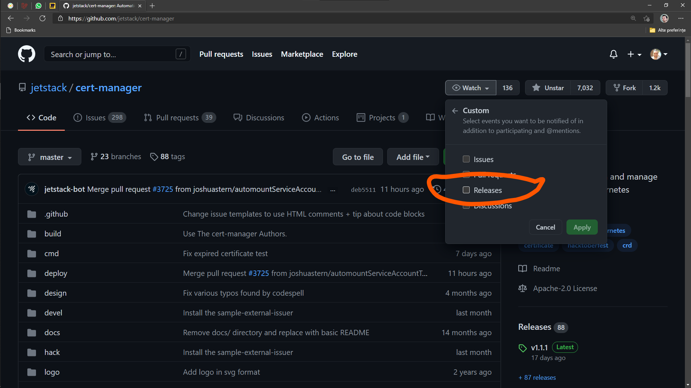

[[ch06-services-versions]]
== Services versions

I'm really glad you've made it this far. We still have a few steps until we achieve a basic production grade concept to deploy WordPress.

In this chapter we are going into the details of versions of services used, that are ideal for WordPress and MariaDB containers.

MicroK8s is a Kubernetes distribution intended to self upgrade, and so long as external addons are kept to a minimum, maintenance of it is minimal.

Normally we must take care of the operating system updates, and I will show you some tricks for automating upgrades and scheduling safe restarts if needed.

Our discussed extra addon until now, **cert-manager**, can be upgraded, by applying the main remote configuration on each new tag, and there are a number of ways to stay up to date on tags, like subscribing on Github to be notified of each new release of the project.

But let's start with our **WordPress** services management.

=== Locking container versions

I'll bring back the full recipe of a WordPress website and we will *talk* about each important part of it.

.https://gist.github.com/madalinignisca/93339ec774b00bc5589b3a45fc968eb5#file-kustomization-yaml[kustomization.yml]
[source,yaml,linenums]
----
---
secretGenerator:
- name: mysql-root-pass
  literals:
  - password=password123
- name: mysql-user
  literals:
  - user=wordpress
- name: mysql-pass
  literals:
  - password=wordpress
- name: mysql-database
  literals:
  - database=wordpress
resources:
  - mysql.yaml
  - wordpress.yaml
----

This is our start, our Kustomization file.

We don't have any mention about a service version in it, but there is one critical thing. **We stored a clear text password in it!** We must not ever do this for production with public facing websites. It was simply easy to use as an example for a private experiment briefly that should be removed afterwards!

What would be best practice when handling secrets for our websites? There are lots of options and opinions on how to do this. Personally, I take an easy approach.

I use a passwords application to save them. I use https://keepass.info[KeePass] and any similar, cloud based solution should be fine also.

Once I've created a new strong password, I'll save it in an organized fashion. In the case of KeePass, I use a dedicated database file for projects, so I create the secret with the password using `kubectl`.

Let's create a configuration template and a bash script to automate the creation and update of a secret. You will be able to reuse this anytime you want to create a new secret or update an existing one. Make a new directory to store these files.

We will also extend our secret to set a custom user name and password for best security practices, and avoid using root user to connect to the database.

.safe-password-manager.yaml.tmpl
[source,yaml,linenums]
----
---
apiVersion: v1
kind: Secret
metadata:
  name: SECRET_NAME
type: Opaque
data:
  # You can include additional key value pairs as you do with Opaque Secrets
  root_password: ROOT_PASSWORD
  username: USER_NAME
  password: USER_PASSWORD
----

.safe-password-manager.sh
[source,bash,linenums]
----
#!/usr/bin/env bash
echo -n "Please enter a secret password name: "
read SECRET_NAME

echo -n "Please enter the root password: "
read -p ROOT_PASSWORD

echo -n "Please enter the username: "
read -p USER_NAME

echo -n "Please enter the user password: "
read -p USER_PASSWORD

echo -e "\n"

sed "s/SECRET_NAME/$SECRET_NAME/g" \
  safe-password-manager.yaml.tmpl | \
  sed "s/ROOT_PASSWORD/`echo $ROOT_PASSWORD|base64`/g" - | \
  sed "s/USER_NAME/`echo $USER_NAME|base64`/g" - | \
  sed "s/USER_PASSWORD/`echo $USER_PASSWORD|base64`/g" - | \
  microk8s.kubectl apply -f -
----

To create a new password now, just run: `bash safe-password-manager.sh` enter the secret name and after the password.

The output should look like:

[source,text]
----
madalin@devserver:~/secret-password-manager$ bash safe-password-manager.sh
Please enter a secret password name: new-secret-password
Please enter the password:

secret/new-secret-password created
----

Next, let's go through the MariaDB service.

.https://gist.github.com/madalinignisca/93339ec774b00bc5589b3a45fc968eb5#file-mysql-yaml[mysql-statefulset.yml]
[source,yaml,linenums]
----
---
apiVersion: v1
kind: Service
metadata:
  name: wordpress-mysql
  labels:
    app: wordpress
spec:
  ports:
    - port: 3306
  selector:
    app: wordpress
    tier: mysql
  clusterIP: None
---
apiVersion: apps/v1
kind: StatefulSet
metadata:
  name: wordpress-mysql
  labels:
    app: wordpress
spec:
  selector:
    matchLabels:
      app: wordpress
      tier: mysql
  serviceName: wordpress-mysql
  template:
    metadata:
      labels:
        app: wordpress
        tier: mysql
    spec:
      containers:
      - image: mariadb:10.6
        name: mysql
        env:
        - name: MARIADB_ROOT_PASSWORD
          valueFrom:
            secretKeyRef:
              name: mysql-root-pass
              key: password
        - name: MARIADB_DATABASE
          valueFrom:
            secretKeyRef:
              name: mysql-database
              key: database
        - name: MARIADB_USER
          valueFrom:
            secretKeyRef:
              name: mysql-user
              key: user
        - name: MARIADB_PASSWORD
          valueFrom:
            secretKeyRef:
              name: mysql-pass
              key: password
        - name: MARIADB_AUTO_UPGRADE
          value: "true"
        ports:
        - containerPort: 3306
          name: mysql
        volumeMounts:
        - name: wordpress-mysql
          mountPath: /var/lib/mysql
  volumeClaimTemplates:
  - metadata:
      name: wordpress-mysql
    spec:
      accessModes: [ "ReadWriteOnce" ]
      resources:
        requests:
          storage: 10Gi
----

We have created MariaDB as a **Stateful** service.

Kubernetes defines a list of https://kubernetes.io/docs/concepts/workloads/controllers/[**Workload Resources**] which include the above **StatefulSet** used by me. Running MariaDB or any other database, requires that each instance has a particular configuration if high availability is desired for databases, and the storage is dedicated to one single instance running.

To lock the MariaDB version we are using, we only need to set the desired value in `- image: mariadb:10.6`. MariaDB uses a 3 number versioning scheme, popular among open source software, usually named https://semver.org/[Semantic Versioning], which defines for `X.Y.Z`:

* **X** is the MAJOR, very critical number, and a project might not be able to change from it easy.
* **Y** is the MINOR, number which indicates that new features have been added, possibly performance enhancements.
* **Z** is the PATCH, the most important number you should care about for the database of a WordPress database. This number means that critical security or bug fixes have been made and you should upgrade as soon as possible.

I do not recommend upgrading a MAJOR for MariaDB or MySQL on an existing WordPress website just for the bravery of stating you have upgraded. Stick to the current recommended MAJOR for the WordPress version you are using until the community is stating for a few good months that it is all working fine on a new MAJOR.

At the time of writing this book WordPress requirements where:

* PHP 7.4 or higher, core runs on 8.0, but many plugins and themes are still not guaranteed to run on 8.x. Stay informed from https://make.wordpress.org/core/[WordPress Developers Blog] for changes.
* MySQL 5.6 or MariaDB 10.1 or recent. This means MySQL 5.7 and any MariaDB 10.x included. It is possible that it will work fine with MySQL 8.0 also. I would stick to long term supported MariaDB versions, 10.6 at current book revision.

So, how can we ensure we use the latest version without getting issues?

Our database stores it's data in a volume we have defined in the above recipe.

I do it this way, and it would be the way I recommend doing it: make a database backup. Avoid using a plugin based backup solution for database and use the command line if you are confident or add a service like Adminer.

**Method 1: command line.**

Let's write a small script to backup a database. You will be able to use it for all WordPress websites you would host with MicroK8s, but not only WordPress, any MySQL/MariaDB based website. We need the mysql/mariadb client installed locally, and as we use Ubuntu as our host operating system, we can have it installed just by running: `sudo apt update && sudo apt install -y mariadb-client`.

.databasebackup.sh
[source,bash,linenums]
----
#!/usr/bin/env bash
echo -n "Hostname: "
read HOSTNAME

echo -n "Username: "
read USERNAME

echo -n "Database: "
read DATABASE

# password will actually be asked by the command itself
mysqldump -h$HOSTNAME -u$USERNAME -p $DATABASE > $DATABASE-`date +"%s"`.sql
----

To get the HOSTNAME, run `microk8s.kubectl get service wpk8s-club-demo-mysql` and it is the value under **CLUSTER-IP**. Replace `wpk8s-club-demo-mysql` with the service name you set for the website.

If you have not saved your password (please try to save passwords in a personal vault, for example KeePass), you can obtain it from the saved secrets: `microk8s.kubectl get secrets | grep wpk8s-club-demo-mysql-pass` to identify secret name with it's possible added hash; `microk8s.kubectl get secret wpk8s-club-demo-mysql-pass-REPLACEHASH -ojson | jq -r ".data.password" | base64 --decode`. Do not forget to replace `wpk8s-club-demo-mysql*` with what you used.

Now you can run the script: `bash databasebackup.sh`. The sql dump will be named using the database and current timestamp suffixed to it. You can copy or move it to a safe place.

You might be concerned that this is a way to read passwords, but do not worry, this is strictly limited to people with access and permissions to manage MicroK8s and use kubectl in the nodes of your cluster. The only issues might be when untrustworthy people have access to the servers with MicroK8s, but that brings the question: *"would you allow an untrustworthy person into your house?"*.

**Method 2: add Adminer.**

Alternatively we can add a database management script, which might help you for other needs as well, especially if you are used to shared hosting where you had easy access to phpMyAdmin.

TIP: You can use phpMyAdmin as an alternative to Adminer if you are more comfortable with it.

In the same directory as our demo website's recipe, let's create an additional yaml file, containing the deployment and service configuration for Adminer.

Replace `wpk8s-club-demo` with the name you used in the rest of configurations.

[source,yaml,linenums]
----
---
apiVersion: v1
kind: Service
metadata:
  name: wpk8s-club-demo-adminer
  labels:
    app: wpk8s-club-demo
spec:
  ports:
    - port: 8080
      protocol: TCP
  selector:
    app: wpk8s-club-demo
    tier: adminer
---
apiVersion: apps/v1
kind: Deployment
metadata:
  name: wpk8s-club-demo-adminer
  labels:
    app: wpk8s-club-demo
spec:
  replicas: 1
  selector:
    matchLabels:
      app: wpk8s-club-demo
      tier: adminer
  template:
    metadata:
      labels:
        app: wpk8s-club-demo
        tier: adminer
    spec:
      containers:
      - image: adminer:4.8.0
        name: adminer
        env:
        - name: ADMINER_DEFAULT_SERVER
          value: wpk8s-club-demo-mysql
        ports:
        - containerPort: 8080
----

Next, we will extract the **Ingress** configuration from `wordpress.yaml`, and extend it

.ingress.yml
[source,yaml,linenums]
----
---
apiVersion: networking.k8s.io/v1
kind: Ingress
metadata:
  name: wpk8s-club-demo
  labels:
    app: wpk8s-club-demo
  annotations:
    cert-manager.io/cluster-issuer: "letsencrypt-prod"
    nginx.ingress.kubernetes.io/proxy-body-size: 10m
    nginx.ingress.kubernetes.io/server-alias: "www.demo.wpk8s.club"
spec:
  tls:
  - hosts:
    - demo.wpk8s.club
    - www.demo.wpk8s.club
    secretName: wpk8s-club-demo-tls
  rules:
  - host: demo.wpk8s.club
    http:
      paths:
        - pathType: Prefix
          path: "/"
          backend:
            service:
              name: wpk8s-club-demo
              port:
                number: 80
        - pathType: Prefix
          path: "/adminer"
          backend:
            service:
              name: wpk8s-club-demo-adminer
              port:
                number: 8080
----

We added to it just the new `/adminer` path, pointing at the new Adminer service we dedicated for this website.

NOTE: In a cluster, you could actually dedicate an Adminer or phpMyAdmin instance, on a domain/subdomain of choice, to support all hosted databases. Alternatively, to separate databases, like for common websites with less sensitive data, you could even use one common database service. We will look into this later, in a section related to saving resources to lower costs.

Edit `kustomization.yaml` and add Adminer and the new Ingress configuration.

.kustomization.yml
[source,yaml,linenums]
----
---
resources:
  - mysql-statefulset.yml
  - wordpress-statefulset.yml
  - adminer-deployment.yml
  - ingress.yml
----

NOTE: It is best to keep the list order exactly the same as the order they would need to be applied, as it will help you understand it better when you have to customize later. Also, I removed the password entry, which now should have been added like described at the beginning of the chapter.

Apply all new changes by running: `microk8s.kubectl apply -k ./`

In your browser, open the website url and add `/adminer` at the end. Fill in the user, password and hostname, in case it was not pre-filled, and start using Adminer to backup, restore and alter the data.

Securing this path could be done in a number of different ways.

* Nginx Ingress annotations to add user and password on the `/adminer` path. I use this on shared Adminer services in a cluster.

* Comment the Adminer entry in the Ingress configuration and apply. It will not serve from the Adminer backend service. It's easy and safe.

* Set replicas to 0 on the Adminer service. Change to 1 for the time you want to use.

I think I have diverted a lot from versioning, by showing you how to backup the database, I did not touch the WordPress files and the uploads as in the current configuration we have used, you are still able to use classic, in WordPress, plugins to do that. Remember, your WordPress installation and your uploads are in a volume, and up until now we have used the builtin Storage add-on, you can find all files in `/var/snap/microk8s/common/default-storage/[extended-name-of-defined-volume`].

So, I would either make a full copy of the directory, using `cp -r /var/snap/microk8s/common/default-storage/[extended-name-of-defined-volume`] filesbackup` or archive them if storage is constrained `tar czfv filesbackup.tar.gz /var/snap/microk8s/common/default-storage/[extended-name-of-defined-volume`]`.

IMPORTANT: Avoid using ZIP to archive web projects, unless you really know what permissions need to be set on files.

As you are controlling the host of the cluster, you could even install Midnight Commander to have a **TUI** application with a familiar interface to manage files. `sudo apt install -y mc` will get it installed for you. Run `sudo mc` and enjoy. You need root access to be able to access volumes files and make sure you don't alter permissions or ownership of files and directories, **mc** has the option when copying or moving to preserve file attributes.

Let's go back to versioning.

In our `wordpress.yaml` we have defined `- image: wpk8s/wordpress:5.6.1`. When a new image is available, all you need to do is change the version and apply. Yes, it's really that simple. But with this way of using WordPress, what is upgraded is actually Apache HTTPD and PHP versions. The official WordPress container image on https://hub.docker.com[Docker Hub] comes with an init script that downloads the WordPress version on the selected tag, puts files in the declared volume and from that moment, WordPress is in control, just like you used it in shared hosting. You are fine to set auto-updates for WordPress, for plugins and for themes the way you were used to doing. An alternative, required for High Availability that forces a locked WordPress installation will be detailed in next chapter.

To experiment, change the version and apply: `microk8s.kubectl apply -k ./` or `microk8s.kubectl apply -f wordpress.yaml` will only update the configuration defined in it.

We can do this for MariaDB or MySQL service as well.

So, we've been through setting exact service versions, and we looked into how to handle upgrades. We discovered how to backup the database and we also discovered where our WordPress files are stored in the default Storage add-on.

It is time now, to discover how to handle high availability mode, with multiple cluster nodes, aka multiple virtual cloud instances. It will force us to set up a more complex storage solution, make the database service able to move from node to node and the same for WordPress.

Also... it's fun, right?
